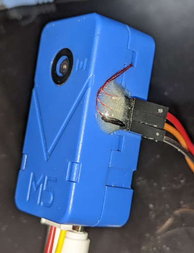

# buildroot_unitv2

## What

This is a mainline Linux (5.16) and mainline u-boot (2022.01rc?) setup for
you m5stack unitv2.



## Why?

Why not?

## Why not?

Wifi doesn't work yet..

## Tools you need

  - iq higher than a pet rock
  - some sort of i2c interface that has Linux kernel drivers i.e. https://github.com/harbaum/I2C-Tiny-USB
  - Cups of tea.
  - SNANDer from my fork - https://github.com/fifteenhex/SNANDer/tree/mstar

## Flashing

### Flashing GCIS.bin, IPL.bin, u-boot spl and ubi

You need to get GCIS.bin and IPL.bin from *somewhere*.

```
sudo ./SNANDer -p mstarddc -c /dev/i2c-4:49 -e
sudo ./SNANDer -p mstarddc -c /dev/i2c-4:49 -w GCIS.bin -v
sudo ./SNANDer -p mstarddc -c /dev/i2c-4:49 -a 0x140000 -w IPL.bin -v
sudo ./SNANDer -p mstarddc -c /dev/i2c-4:49 -a 0x200000 -w outputs/unitv2-ipl -v
sudo ./SNANDer -p mstarddc -c /dev/i2c-4:49 -a 0xEC0000 -w outputs/unitv2-ubi.img -v
```

### Loading from the rescue image

WIP

On the host:

```
ip link set dev enx00e099313e0b up
ip a add 20.20.20.1/24 dev enx00e099313e0b
```
